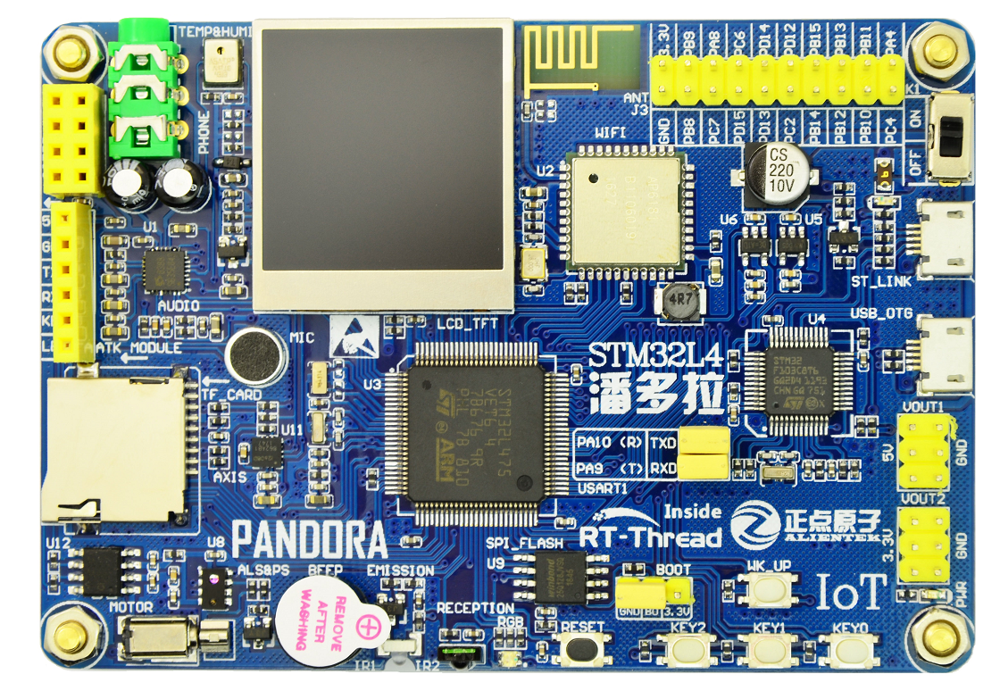

# AIoT__Device-Sensor STM32L475 使用手册

随着物联网的兴起，新的开发需求不断涌现，越来越多的设备需要添加联网功能。

此仓库主要以 STM32L475（STM32L475VET6 ） MCU 平台，进行 AIoT 设备端的平台搭建。

通过分享目前最常用的 IOT 相关技术，以及关键技术组件如低功耗、安全、OTA、云平台接入等，助力开发者更快地掌握物联网产品开发关键技术，更快捷地进行产品开发或 DIY。

# IoT Board 物联网开发套件硬件相关

## IoT Board 开发套件硬件资源

## STM32L475VET6  微控制器

STM32L475VET6 是 ST（意法半导体）公司推出的一款 MCU（微控制器）。

STM32L475VET6 基本特性：

- ARM Cortex-M4 内核
- 芯片最高主频为 80 MHz
- 512KB 片上 Flash
- 128KB 片上 SRAM
- 低功耗
- 9 个 16 位定时器、 2 个 32 定时器、１个 RTC（带日历功能）
- 5 个串口、１个低功耗串口
- 2 个 DMA 控制器（共 14 个通道）
- 1 个全速 USB OTG
- １个 CAN 接口
- 3 个 SPI 、１个 SDIO 接口
- 3 个 IIC
- 1 个 FSMC 接口
- 2 个 SAI 音频外设
- 3 个 12 位 ADC
- 2 个 12 位 DAC
- 1 个硬件随机数生成器
- 82 个通用 IO 口
- 100 个引脚，LQFP100 封装

## 常用外设

| MCU模块 | 外设模块                                | SCH（MCU）                                                   | 备注 |
| ------- | --------------------------------------- | ------------------------------------------------------------ | ---- |
| GPIO    | RGB 状态指示灯：1个，（红、绿、蓝三色） |                                                              |      |
| GPIO    | 按键：4个                               | KEY_UP（兼具唤醒功能，PC13），K0（PD10），K1（PD9），K2（PD8） |      |
| GPIO    | 有源蜂鸣器：1个                         |                                                              |      |
| RTC     | 支持外部晶振和内部低速时钟              |                                                              |      |
| UART    | 板载 ST-LINK 转串口                     |                                                              |      |
| SWD     | 板载 ST-LINK                            |                                                              |      |
| QSPI    | 外部 FLASH：W25Q128（SPI，16MB）        |                                                              |      |
| SPI1    | SD 卡接口、USB OTG Micro USB 接口       |                                                              |      |
| SPI3    | TFT LCD 显示屏                          |                                                              |      |
| SDIO    | WIFI 模块（AP6181）                     |                                                              |      |
|         | 高性能音频解码芯片                      |                                                              |      |
|         | 温湿度传感器（AHT10）                   |                                                              |      |
|         | 红外发射头，红外接收头                  |                                                              |      |
|         | 光环境传感器：1个                       |                                                              |      |
|         | 贴片电机：1个                           |                                                              |      |
|         | 六轴传感器：1个                         |                                                              |      |
|         |                                         |                                                              |      |

## 扩展模块

| 扩展模块         | SCH（MCU）                                                   | 备注 |
| ---------------- | ------------------------------------------------------------ | ---- |
| NRF24L01 模块    | 根据实际板子接线情况修改 NRF24L01 软件包中的 `NRF24L01_CE_PIN` 和 `NRF24_IRQ_PIN` 的宏定义，以及 SPI 设备名 |      |
| enc28j60 模块    |                                                              |      |
| ATK-ESP8266 模块 |                                                              |      |

## ST-Link 仿真器、烧写器

- 开发板上集成 ST-Link V2.1 仿真器、固件烧写器，无需购买任何仿真器。

- 调试接口，ST-LINK Micro USB 接口.

# IoT Board 物联网 模块

