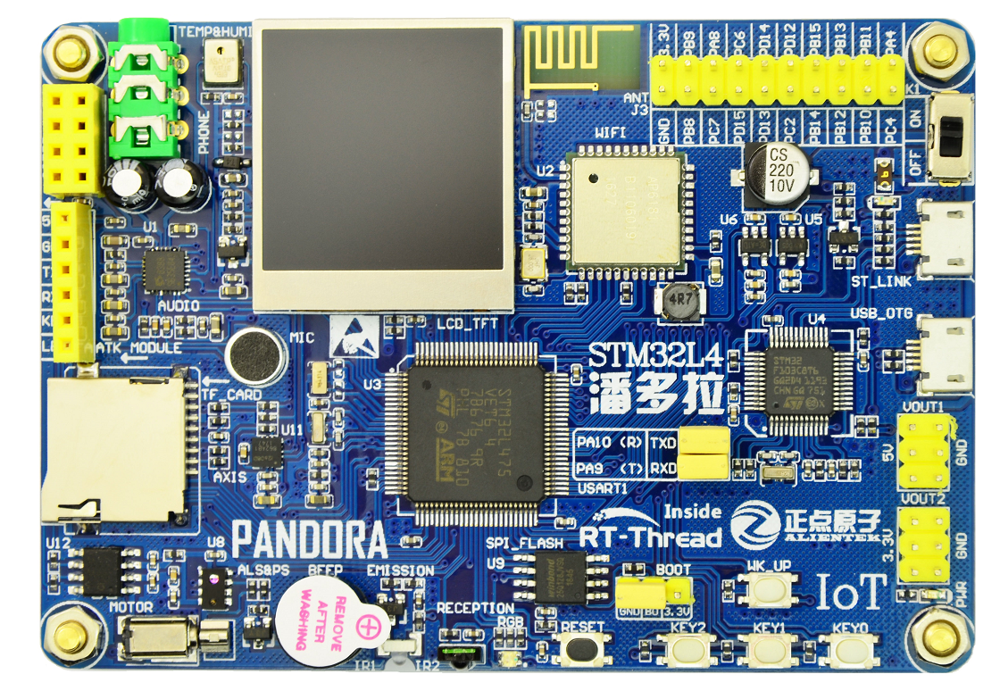
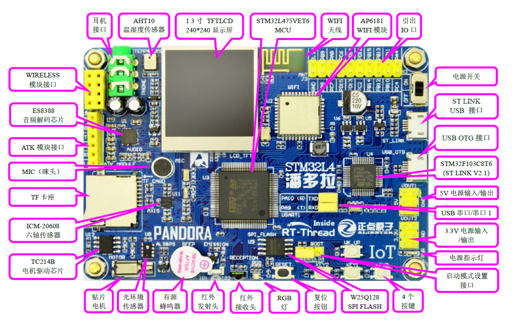

# AIoT__Device-Sensor STM32L475 使用手册

随着物联网的兴起，新的开发需求不断涌现，越来越多的设备需要添加联网功能。

此仓库主要以 STM32L475（STM32L475VET6 ） MCU 平台，进行 AIoT 设备端的平台搭建。

通过分享目前最常用的 IOT 相关技术，以及关键技术组件如低功耗、安全、OTA、云平台接入等，助力开发者更快地掌握物联网产品开发关键技术，更快捷地进行产品开发或 DIY。

# IoT Board 物联网开发套件硬件相关

## IoT Board 开发套件硬件资源

## STM32L475VET6  微控制器

STM32L475VET6 是 ST（意法半导体）公司推出的一款 MCU（微控制器）。这是 ST 公司专为低功耗应用场景打造的芯片，非常适合物联网低功耗场景的应用。

STM32L475VET6 基本特性：

- ARM Cortex-M4 内核
- 芯片最高主频为 80 MHz
- 512KB 片上 Flash
- 128KB 片上 SRAM
- 低功耗
- 9 个 16 位定时器、 2 个 32 定时器、１个 RTC（带日历功能）
- 5 个串口、１个低功耗串口
- 2 个 DMA 控制器（共 14 个通道）
- 1 个全速 USB OTG
- １个 CAN 接口
- 3 个 SPI 、１个 SDIO 接口
- 3 个 IIC
- 1 个 FSMC 接口
- 2 个 SAI 音频外设
- 3 个 12 位 ADC
- 2 个 12 位 DAC
- 1 个硬件随机数生成器
- 82 个通用 IO 口
- 100 个引脚，LQFP100 封装

## 常用外设

| MCU模块 | 外设模块                                | SCH（MCU）                                                   | 备注 |
| ------- | --------------------------------------- | ------------------------------------------------------------ | ---- |
| GPIO    | RGB 状态指示灯：1个，（红、绿、蓝三色） |                                                              |      |
| GPIO    | 按键：4个                               | KEY_UP（兼具唤醒功能，PC13），K0（PD10），K1（PD9），K2（PD8） |      |
| GPIO    | 有源蜂鸣器：1个                         |                                                              |      |
| RTC     | 支持外部晶振和内部低速时钟              |                                                              |      |
| UART    | 板载 ST-LINK 转串口                     |                                                              |      |
| SWD     | 板载 ST-LINK                            |                                                              |      |
| QSPI    | 外部 FLASH：W25Q128（SPI，16MB）        |                                                              |      |
| SPI1    | SD 卡接口、USB OTG Micro USB 接口       |                                                              |      |
| SPI3    | TFT LCD 显示屏                          |                                                              |      |
| SDIO    | Wi-Fi 模块：AP6181                      |                                                              |      |
|         | 高性能音频解码芯片：ES8388              |                                                              |      |
| IIC     | 温湿度传感器（AHT10）                   |                                                              |      |
|         | 红外发射头，红外接收头                  |                                                              |      |
|         | 光环境传感器：1个                       |                                                              |      |
|         | 贴片电机+TC214B 电机驱动芯片            |                                                              |      |
|         | 六轴传感器：ICM20608                    |                                                              |      |
|         |                                         |                                                              |      |

## 扩展模块

| 扩展模块         | SCH（MCU）                                                   | 备注 |
| ---------------- | ------------------------------------------------------------ | ---- |
| NRF24L01 模块    | 根据实际板子接线情况修改 NRF24L01 软件包中的 `NRF24L01_CE_PIN` 和 `NRF24_IRQ_PIN` 的宏定义，以及 SPI 设备名 |      |
| enc28j60 模块    |                                                              |      |
| ATK-ESP8266 模块 |                                                              |      |

## ST-Link 仿真器、烧写器

- 开发板上集成 ST-Link V2.1 仿真器、固件烧写器，无需购买任何仿真器。
- 支持程序下载、仿真调试和串口通讯功能，仅需要一根 Micro USB 线就可以实现 STM32 开发的全部需求（供电、下载、仿真、串口通讯）。  

# 开发板模块

## 电源模块

### 电源开关  

这是开发板板载的电源开关（K1）。该开关用于控制整个开发板的供电，如果切断，则整个开发板都将断电，电源指示灯（PWR）会随着此开关的状态而亮灭。  

### 电源指示灯  

板载的一颗蓝色的 LED 灯（PWR），用于指示电源状态。在电源开启的时候（通过板上的电源开关控制），该灯会亮，否则不亮。通过这个 LED，可以判断开发板的上电情况。  

### 3.3V 电源输入/输出 

板载的一组 3.3V 电源输入输出排针（2*3）（VOUT2），用于给外部提供 3.3V 的电源，也可以用于从外部接 3.3V 的电源给板子供电（最大电流不能超过 500mA）。   

### 5V 电源输入/输出  

板载的一组 5V 电源输入输出排针（2*3）（VOUT1），该排针用于给外部提供 5V 的电源，也可以用于从外部接 5V 的电源给板子供电。  

## 启动模式配置接口  

板载的启动模式选择端口（BOOT）， STM32 有 BOOT0（B0）（BOOT1 通过软件配置）选择引脚，用于选择复位后 STM32 的启动模式，作为开发板，这两个是必须的。在开发板上，我们通过跳线帽选择 STM32 的启动模式。  

## RGB 灯  

板载的一个 RGB 灯，通过 R（红）、 G（绿）和 B（蓝）三种颜色的组合我们可以实现各种不同的颜色。  

## 有源蜂鸣器  

这是开发板的板载蜂鸣器（BEEP），可以实现简单的报警/闹铃，让开发板可以发声。  

## 按键  

### 复位按钮  

板载的复位按键（RESET），用于复位开发板上的主芯片 STM32L475VET6。  

### WK_UP 轻触按键

板载的 WK_UP 轻触按键具有唤醒功能，该按键连接到 STM32 的 WKUP2（PC13）引脚，可用于待机模式下的唤醒，在不使用唤醒功能的时候，也可以做为普通按键输入使用。  

注意：WK_UP 是高电平有效 。

### 普通轻触按键（KEY0、 KEY1、 KEY2 ）

可以用于人机交互的输入，这 3 个按键是直接连接在 STM32 的 IO 口上的。  

注意：KEY0、 KEY1 和 KEY2 是低电平有效。

## 引出 IO 口  

这是开发板 IO 引出端口（J3），总共引出 18 个 IO 口和一组 3.3V 电源输出口，供大家外接使用。  

## STM32F103C8T6（ST-Link ）

这是开发板板载的 ST LINK V2.1 功能，可以实现程序下载、软件仿真和串口通讯功能，大家仅需要使用一根 Micro USB 线就可以使用这些功能。  

### ST LINK 接口  

这是开发板板载的 ST LINK V2.1 的 Micro USB 接口，用来连接电脑 USB 口，当然通过这个接口也可以给开发板供电。使用 Micro USB 线将这个接口与电脑 USB 连接后，电脑可以识别到 ST LINK 和一个 COM 口。注意：这里需要提前安装 ST LINK 和 STM32 USB 虚拟串口驱动。  

### USART1（ST-Link USB 转 UART）

这是 ST LINK V2.1 的串口同 STM32 的串口 1 进行连接的接口（USART1），标号 RXD 和 TXD 是ST LINK 转串口的 2 个数据口（对 ST LINK 来说）。

而 PA9(TXD) 和 PA10(RXD) 则是 STM32 的串口1 的两个数据口（复用功能下）。

他们通过跳线帽对接，就可以和连接在一起了，从而实现 STM32 的串口通信。

有了板载的 ST LINK V2.1 功能，我们就能省去 USB 转 TTL 的工具，只需要一根 Micro USB 线就可以实现串口输出功能。  

## USB OTG 接口  

这是开发板板载的一个 Micro USB 座（USB_OTG），这个接口是直接与 STM32L475VET6 的 USB OTG 引脚连接的。

我们可以用过这个接口来实现 STM32L4 的从机和主机功能。

如果要使用 USB 主机供能需要另外准备 USB OTG 转接线。  

## SPI FLASH  

开发板外扩的 SPI FLASH 芯片（U9），型号为： W25Q128，容量为 128Mbit，即 16M 字节，可用于存储字库和其他用户数据，满足大容量数据存储要求。  

## TF 卡  

板载的一个标准 TF 卡接口（TF_CARD），采用 SPI 方式驱动，有了这个 TF 卡接口，就可以满足大量数据存储的需求。  

## TFT LCD 显示屏 

板载的一个 TFT LCD 显示屏（LCD_TFT），它是一个 1.3 寸 240*240 超高分辨率的显示屏，支持 16 位真彩色显示。   

## 高性能音频解码芯片：ES8388  

开发板板载的一个低功耗、高性能音频解码芯片（U1）。该芯片内部集成了 24 位高性能DAC&ADC，可以播放最高 96K@24bit 的音频信号。大家可以使用这个芯片实现音乐播放、录音和语音识别等功能。  

### 低功耗特性

我们可以通过控制音频电路的开关来降低功耗 。

### 耳机接口  

板载的音频输出接口（PHONE），该接口可以插 3.5mm 的耳机，当 ES8388 放音乐的时候，就可以通过在该接口插入耳机欣赏音乐。  

### MIC（咪头）  

板载录音输入口（MIC），该咪头直接接到 ES8388 的输入上，可以用来实现录音功能。  

## Wi-Fi 模块：AP6181

板载的一个 Wi-Fi 模块（U2），它是一款低功耗、高速的 Wi-Fi 模块，支持标准的 SDIO 接口。通过这个板载的 Wi-Fi 模块，可以很轻松的实现开发板的联网功能。

### Wi-Fi 天线  

这是开发板板载的一个 Wi-Fi 天线（ANT），可以直接作为 Wi-Fi 的天线使用。  

### 低功耗特性

WIFI 模块的中断唤醒引脚接在了 MCU 的 WKUP 上。

## AHT10 温湿度传感器  

板载的一个温湿度传感器（U7），它集成了温度传感器和湿度传感器的功能，可以用于环境监测等场景，该芯片使用 IIC 通讯。  

## ICM20608 六轴传感器  

板载的一个六轴传感器（U11）， ICM20608 是 Inven Sense 新推出的一款六轴传感器，内部集成 1 个三轴加速度传感器和 1 个三轴陀螺仪，它具有更低的功耗、更低的噪音和更薄的封装，并且支持 MPL 库，该传感器可用于四轴飞控。所以喜欢玩四轴的朋友，也可通过本开发板进行学习。

## 红外控制

板载的红外发射头（IR1），可以实现红外发射功能，使用这个发射头，我们可以模拟红外遥控器的功能。  

板载的红外接收头（IR2），可以实现红外接收功能，通过这个接收头，可以接收市面常见的各种遥控器的红外信号，大家甚至可以自己实现万能红外解码。当然，如果应用得当，该接收头也可以用来传输数据。  

## 电机控制：贴片电机+TC214B 电机驱动芯片

这是开发板板载的一个电机驱动芯片（U12），它支持 1.2A 的持续电流输出，峰值电流高达 2.0A，可以通过两路 PWM 来同时控制电机的速度与方向。

板载的一个贴片电机（MOTOR），我们可以用过 TC214B 驱动芯片，来控制电机的转速和方向。

## 光环境传感器  

板载的一个光环境三合一传感器（U8），它可以作为：环境光传感器、近距离（接近）传感器和红外传感器。

通过该传感器，开发板可以感知周围环境光线的变化，接近距离等，从而可以实现类似手机的自动背光控制。  
